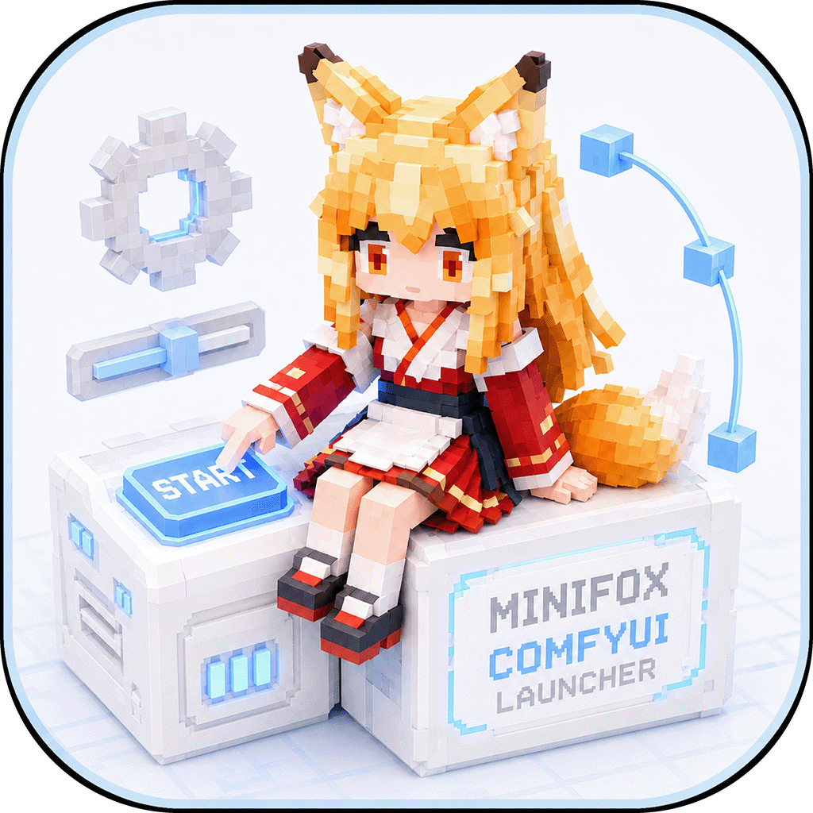

<div align="center">
  
  <h1>Minifox ComfyUI Launcher</h1>
  <p><strong>面向 Windows 的便携式单文件 ComfyUI 启动器</strong></p>
  <p><a href="README.md">English</a> · 简体中文</p>
  <p>
    
    
    
    <a href="LICENSE"></a>
  </p>
</div>

Minifox 是面向 Windows 10/11 x64 的便携式 ComfyUI 启动器，专门用于配置、启动和管理 ComfyUI。程序使用 Qt 6、Qt Quick、C++20、QML 和 CMake 开发，可构建为无需附带 Qt DLL 的单文件 EXE，直接放入现有 ComfyUI 整合包使用。

Minifox 不使用注册表，不修改 ComfyUI 源码，也不内置浏览器或 WebUI。

## 主要功能

- 内置默认设置，也可管理多套 ComfyUI 启动配置、参数和运行环境
- 启动、停止并监控 ComfyUI 进程、状态和控制台输出
- 管理 ComfyUI 内核与扩展的版本、更新和回退
- 识别 CUDA、ROCm 或适用的 ZLUDA 环境
- 对首页提供较高的个性化自由度

## 直接使用

将 `Minifox ComfyUI Launcher.exe` 放到 ComfyUI 整合包目录后运行：

```text
ComfyUI-Package/
├─ Minifox ComfyUI Launcher.exe
├─ ComfyUI/
│  └─ main.py
└─ python/
   └─ python.exe
```

启动器会自动识别常见的便携目录，也可以在启动配置中手动选择 Python 和 ComfyUI 路径。


## GPU 与 ZLUDA

启动器先识别系统显卡，再判断整合包中的 PyTorch 后端：

| 环境 | 行为 |
|---|---|
| CUDA 或 ROCM | 使用原生PyTorch |
| 仅 AMD 显卡与 CUDA PyTorch | 自动准备 ZLUDA |

ZLUDA注入是最低优先级。

> **兼容性说明：** HIP SDK 5.7 + ZLUDA 已通过测试。任何使用 CK (Composable Kernel) 或 MIOpen 的内容均未测试，不应视为已受支持或稳定可用。

> **另附建议：** HIP SDK 7.1 + ZLUDA 的组合受支持但不如 HIP SDK 5.7 组占用稳定。强烈推荐 AMD 显卡使用原生 Pytorch (正式版或 Rocm Preview 7.14 及之后版本) 。如用 ZLUDA 请配合适配的 Triton Wheel 使用。

### AMD ZLUDA 前置条件

1. 使用 AMD 官方安装器安装 HIP SDK，并保留安装器创建的 `HIP_PATH`。
2. HIP 安装目录中应包含适用于当前显卡 `gfx` 架构的 rocBLAS/Tensile 文件等相关文件：

   ```text
   <HIP_PATH>\bin\rocblas\library\
   ```

3. 使用原本面向 NVIDIA显卡 的 ComfyUI 整合包。

Minifox 内置 HIP SDK 5.7 和 HIP SDK 7.1 ZLUDA 运行组件，但不内置针对特定 `gfx` 的 rocBLAS/Tensile 补丁，也不维护有限的显卡架构白名单。

仓库只保存并编入启动器通用的 `assets/zluda/zluda.extpack`。在符合条件的纯 AMD 环境中，Minifox 会读取实际的 `gcnArchName`，将运行组件释放到 `.minifox`、准备缓存，并且只向 ComfyUI 子进程注入所需环境。

启动器不会修改 ComfyUI、PyTorch、HIP 安装文件或系统环境变量。已经释放且版本未变化的运行包不会重复解压，已有缓存会继续复用。

## 版本管理

内核页可查看稳定版、开发版、远程分支和历史提交；扩展页可查看已安装扩展的当前分支、版本、日期和远程仓库。

- 刷新列表只读取远程信息，不修改工作目录。
- 内核版本切换、分支切换和一键更新（更新到当前浏览页的最新版）会先后执行 `git reset --hard` 与 `git clean -ffd`。
- 扩展版本切换会显示提交说明、日期和当前版本，不需要手工输入 commit ID。
- 远程仓库地址可通过 `Ctrl + 左键` 在默认浏览器中打开。

> **注意：** 强制切换或更新会丢弃仓库内已修改文件，并删除未跟踪文件和目录。需要保留的内容请提前备份。

## 便携数据

程序按需在 EXE 旁创建：

```text
.minifox/
├─ application-settings.json
├─ launch-profiles.json
├─ icons/
│  └─ custom.png
├─ skins/
├─ packages/
└─ runtime/
.cache/
├─ zluda/
├─ triton/
└─ torchinductor/
```

`.minifox` 与 `.cache` 会自动设为隐藏目录。`.cache` 中的内容只会在使用 ZLUDA 时写入和读取；NVIDIA、原生 ROCm 及其他非 ZLUDA 启动路径不会使用该目录。

## 构建要求

- Windows 10/11 x64
- MSYS2 UCRT64 GCC，支持 C++20
- CMake 3.25+ 与 Ninja
- Qt 6.8+：Core、Gui、Network、Qml、Quick、QuickControls2、LinguistTools，以及仅测试时需要的 Test

当前已使用 Qt 6.11.1、GCC 16.1.0、CMake 4.4.0 和 Ninja 1.13.2 验证。

### 安装依赖

在“MSYS2 UCRT64”终端中执行：

```bash
pacman -Syu
```

如果终端要求重启，请关闭后重新打开，再安装动态 Qt 构建依赖：

```bash
pacman -S --needed \
  mingw-w64-ucrt-x86_64-toolchain \
  mingw-w64-ucrt-x86_64-cmake \
  mingw-w64-ucrt-x86_64-ninja \
  mingw-w64-ucrt-x86_64-qt6-base \
  mingw-w64-ucrt-x86_64-qt6-declarative \
  mingw-w64-ucrt-x86_64-qt6-tools
```

如需生成无需 Qt DLL 的单文件 EXE，再安装静态 Qt：

```bash
pacman -S --needed \
  mingw-w64-ucrt-x86_64-qt6-static \
  mingw-w64-ucrt-x86_64-libwebp \
  mingw-w64-ucrt-x86_64-libtiff
```

静态 Qt 安装体积较大，请预留至少 4 GB 空间。

## 构建

在 Windows PowerShell 中进入仓库根目录。

调试版、QML 检查和单元测试：

```powershell
.\scripts\build.ps1 -Preset ucrt64-debug -RunTests
```

动态 Release：

```powershell
.\scripts\build.ps1 -Preset ucrt64-release
```

> 动态版是开发构建，不会自动复制 Qt DLL、QML 模块和插件，不能作为单文件直接分发。需要部署动态版时，请另外使用 `windeployqt` 收集运行依赖。

单文件静态 Release：

```powershell
.\scripts\build.ps1 -Preset ucrt64-static-release
```

静态版输出：

```text
build/Release/Minifox ComfyUI Launcher.exe
```

如果 MSYS2 不在 `C:\msys64`，可传入安装目录：

```powershell
.\scripts\build.ps1 -Preset ucrt64-static-release -Msys2Root "D:\msys64"
```

也可以设置环境变量：

```powershell
$env:MINIFOX_MSYS2_ROOT = "D:\msys64"
.\scripts\build.ps1 -Preset ucrt64-debug -RunTests
```

若 PowerShell 阻止本地脚本，可仅为当前进程放行：

```powershell
Set-ExecutionPolicy -Scope Process Bypass
```

### 手动构建

首次配置应使用目标 Qt 自带的 `qt-cmake.bat`。静态预设必须使用静态 Qt 的 `qt-cmake.bat`。

动态 Debug：

```powershell
$env:Path = "<MSYS2>\ucrt64\bin;$env:Path"
& "<MSYS2>\ucrt64\bin\qt-cmake.bat" --preset ucrt64-debug
cmake --build --preset ucrt64-debug
cmake --build --preset ucrt64-debug --target all_qmllint
ctest --preset ucrt64-debug
```

单文件静态 Release：

```powershell
$env:Path = "<MSYS2>\ucrt64\bin;$env:Path"
& "<MSYS2>\ucrt64\qt6-static\bin\qt-cmake.bat" --preset ucrt64-static-release
cmake --build --preset ucrt64-static-release
```

| 预设 | 用途 | 输出 |
|---|---|---|
| `ucrt64-debug` | Debug、QML 检查和单元测试 | `build/debug/` |
| `ucrt64-release` | 动态链接 Release | `build/release/` |
| `ucrt64-static-release` | 单文件静态 Release | `build/Release/` |

## 源码结构

```text
app/                         应用入口、页面组合和应用级后端
core/configuration/          启动配置、参数目录和高级选项
core/application-settings/   主题、语言、代理和应用设置
core/runtime/                命令、依赖检查、进程、日志和控制台
core/skin/                   皮肤、资源导入导出和首页布局
shared/                      通用 C++ 能力、主题和 QML 控件
platform/windows/            Windows 平台实现
assets/zluda/                内置通用 ZLUDA 运行包
scripts/                     可复现构建入口
.github/workflows/           GitHub Actions 编译与测试
```

业务依赖方向：

```text
Minifox.App UI -> Configuration / Runtime / ApplicationSettings UI -> Minifox.Shared UI
app backend    -> core backends                                  -> shared / platform
```

QML 不直接读写配置文件或操作进程，页面通过 `appContext` 调用 C++ 后端。

生成的构建目录、可执行文件、便携运行数据和本机缓存均不进入版本控制；仓库只保留源码、内置资源和可复现构建配置。

## 持续集成

GitHub Actions 在 Windows UCRT64 环境中执行：

1. Debug 配置与编译
2. QML 静态检查
3. C++ 单元测试
4. 单文件静态 Release 编译验证

CI 只验证源码，不上传或发布 EXE、DLL、安装包等构建产物。

## 鸣谢

- 感谢 [ZLUDA 项目及社区](https://github.com/vosen/ZLUDA) 对非 NVIDIA GPU 运行 CUDA 应用所做的长期探索与贡献。
- 感谢 B 站 UP 主 [秋葉aaaki](https://space.bilibili.com/12566101) 及秋叶启动器为国内 ComfyUI 用户提供的整合、启动器实践与经验。

## 许可证

本项目采用 [GNU General Public License v3.0](LICENSE)（`GPL-3.0-only`）发布。

你可以使用、复制、修改和分发本项目。分发修改版或衍生作品时，必须遵守 GPLv3，包括向接收者提供相应源码并保留 GPLv3 授权。完整条款见 [LICENSE](LICENSE)。
